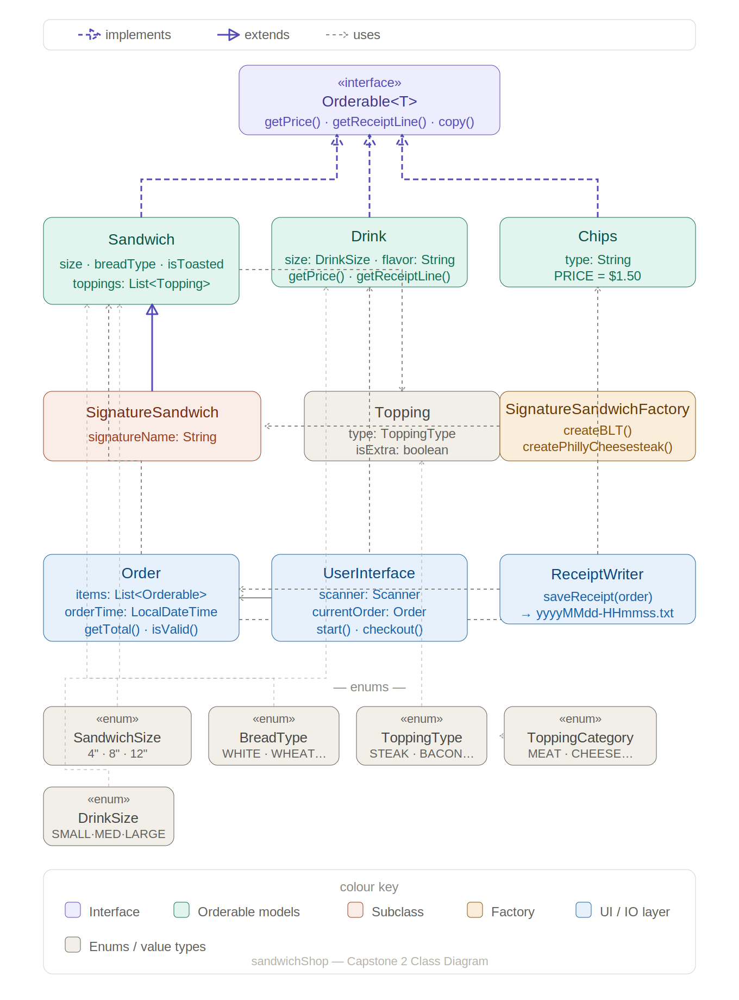

🥪 AROUND'A CORNER Sandwich Shop
A console-based sandwich ordering system built in Java where customers can build custom sandwiches, choose signature sandwiches, add drinks and chips, and receive a saved receipt.
---
Features
Build a fully custom sandwich — choose your size, bread, toppings, and whether you want it toasted
Choose from pre-built Signature Sandwiches (BLT, Philly Cheese Steak) and customize them
Add drinks in 3 sizes with any flavor
Add chips in 5 flavors
Live cart total shown on every screen
Full receipt preview before confirming your order
Receipt automatically saved to the `receipts/` folder with a timestamp filename
---
How to Run
Prerequisites
Java 17 or higher
Compile
```bash
mkdir -p out
find src -name "*.java" | xargs javac -d out
```
Run
```bash
java -cp out com.pluralsight.Main
```
IntelliJ / Eclipse
Open the `DELIcious/` folder as a project
Mark `src/main/java` as the Sources Root
Run `Main.java`
---
How to Order
```
HOME MENU
  1) New Order
  2) Exit

ORDER MENU  (Cart: 0 item(s) — $0.00)
  1) Add Sandwich
  2) Add Drink
  3) Add Chips
  4) Checkout
  5) Cancel Order
```
Building a sandwich:
Choose Custom or Signature
Pick a size (4", 8", or 12")
Pick a bread type
Add toppings — meats, cheeses, veggies, and sauces are each prompted separately
Choose toasted or not
Checking out:
A full receipt preview is shown before confirming
Confirm with `y` to complete the order
Your receipt is saved to the `receipts/` folder automatically
---
Pricing Guide
Sandwich Base Price
Size	Price
4"	$5.50
8"	$7.00
12"	$8.50
Meat Toppings
Size	Per Meat	Extra Meat
4"	$1.00	+$0.50
8"	$2.00	+$1.00
12"	$3.00	+$1.50
Cheese Toppings
Size	Per Cheese	Extra Cheese
4"	$0.75	+$0.30
8"	$1.50	+$0.60
12"	$2.25	+$0.90
Other Items
Item	Price
Chips	$1.50
Small Drink	$2.00
Medium Drink	$2.50
Large Drink	$3.00
Free toppings (always included at no charge):
Lettuce, Peppers, Onions, Tomatoes, Jalapeños, Cucumbers, Pickles, Guacamole, Mushrooms, Mayo, Mustard, Ketchup, Ranch, Thousand Island, Vinaigrette
---
Signature Sandwiches
🥓 BLT
8" White bread — Toasted
Bacon, Cheddar, Lettuce, Tomatoes, Ranch
🥩 Philly Cheese Steak
8" White bread — Toasted
Steak, American Cheese, Peppers, Mayo
---
Sample Receipt
```
╔══════════════════════════════════════╗
║          🥪 AROUND'A CORNER 🥪      ║
║      Your Receipt — Thank You!       ║
╠══════════════════════════════════════╣
  Order Time: 2023-03-29 12:15:23
──────────────────────────────────────
  [Signature: BLT]
  Sandwich (8", White [TOASTED]) ......... $11.50
      + Bacon
      + Cheddar
      + Lettuce
      + Tomatoes
      + Ranch
  Drink (Large Cola) .................... $3.00
  Chips (BBQ) ........................... $1.50

──────────────────────────────────────
  ORDER TOTAL: ......................... $16.00
╚══════════════════════════════════════╝
```
Receipts are saved to `receipts/yyyyMMdd-HHmmss.txt` — for example `receipts/20230329-121523.txt`.
---
Built as part of the Pluralsight Java Development Bootcamp — Capstone 2

## Class Diagram

